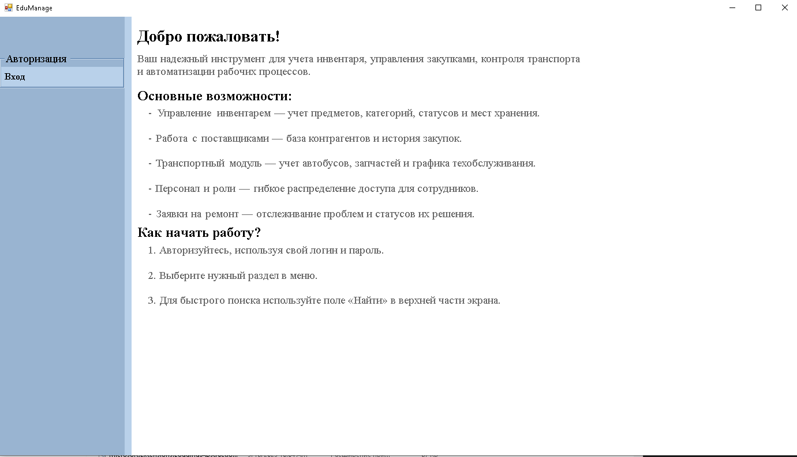
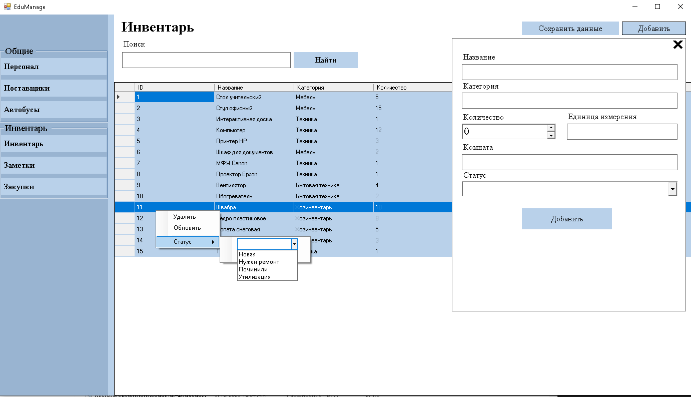
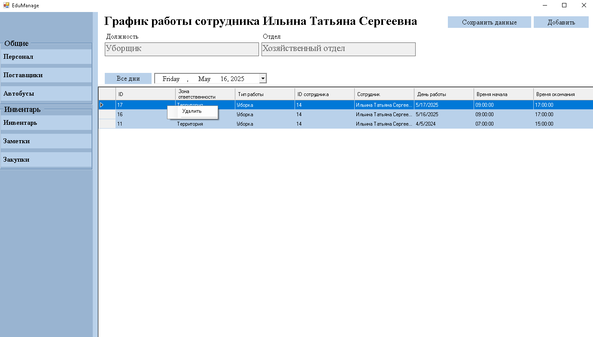
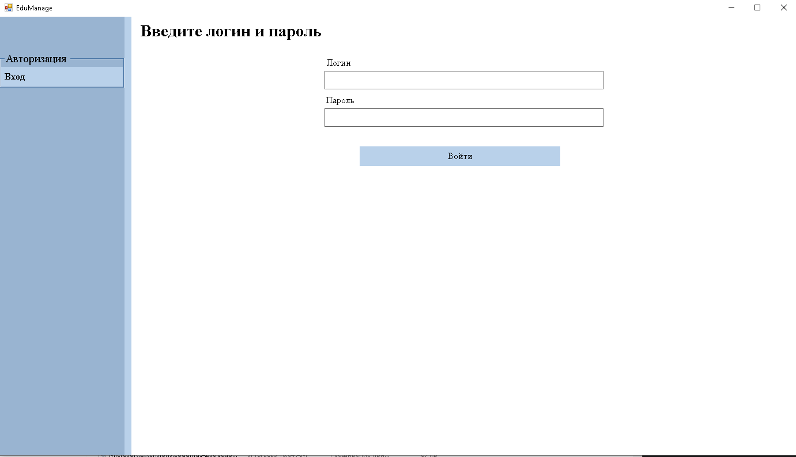
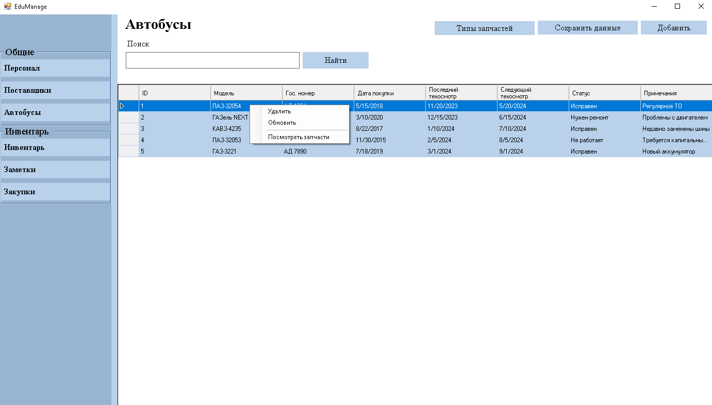
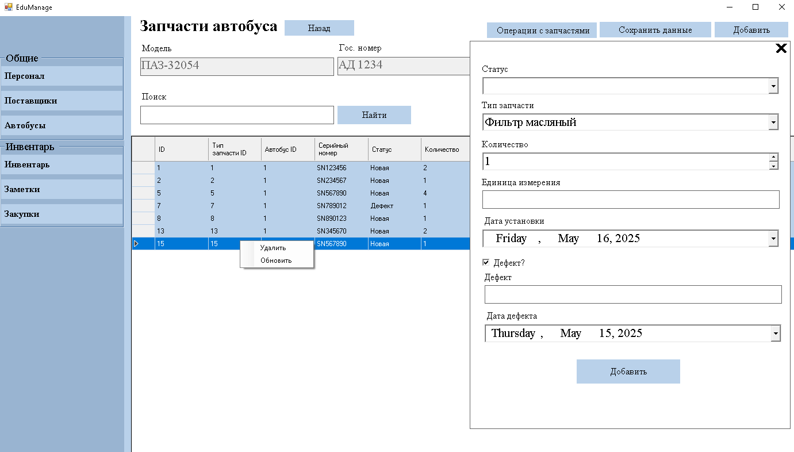

# EduManage - Система управления хозяйственной деятельностью образовательного учреждения

## Описание проекта

EduManage - это программное обеспечение для автоматизации процессов управления хозяйственной деятельностью в образовательных учреждениях. Система предназначена для сотрудников административно-хозяйственной части (АХЧ) и позволяет эффективно организовать работу по следующим направлениям:

- Учет и управление инвентарем
- Контроль закупок и поставок
- Управление заявками на ремонт
- Планирование работы персонала
- Учет транспортных средств и запчастей

## Функциональные возможности

### Основные модули:

1. **Управление персоналом**

   - Учет сотрудников АХЧ
   - Назначение ролей и прав доступа
   - Планирование графика работы

2. **Учет инвентаря**

   - Ведение базы материальных ценностей
   - Контроль состояния оборудования
   - Учет перемещений и списаний

3. **Закупки и поставки**

   - Управление списком поставщиков
   - Формирование заявок на закупку
   - Контроль выполнения поставок

4. **Ремонты и обслуживание**

   - Прием и обработка заявок на ремонт
   - Назначение ответственных
   - Контроль выполнения работ

5. **Транспортный модуль**
   - Учет автопарка
   - Контроль технического состояния
   - Учет запчастей и ремонтов

## Технологический стек

- **Язык программирования**: C#
- **Среда разработки**: Visual Studio Community
- **Система управления базами данных (СУБД)**: PostgreSQL
- **Библиотека для работы с БД**: Npgsql (ADO.NET для PostgreSQL)
- **Диаграммы и модели**: ER-диаграммы, UML

## Установка и запуск

1. Клонировать репозиторий:
   ```bash
   git clone https://github.com/KaliShau/Diplom-of-classmates.git
   ```

## Структура базы данных

Проект использует реляционную базу данных PostgreSQL. Полная схема БД представлена в SQL-файле в репозитории. Основные таблицы:

- `users` - пользователи системы
- `roles` - роли и права доступа
- `staff` - сотрудники учреждения
- `inventory` - материальные ценности
- `suppliers` - поставщики
- `purchases` - закупки
- `requests` - заявки на ремонт
- `buses` - транспортные средства
- `part_types`, `bus_parts` - учет запчастей

## Картинки












